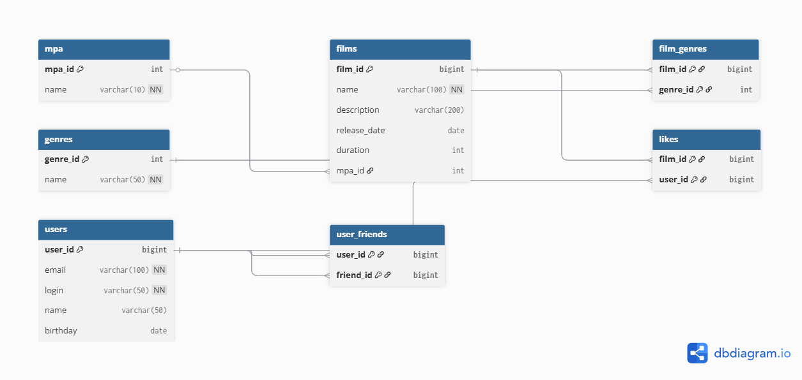

# Filmorate


## Описание проекта

**Filmorate** — это бэкенд-сервис для платформы по управлению фильмами и пользовательскими оценками, разработанный на **Java** с использованием **Spring Boot**. Проект предназначен для демонстрации построения **RESTful API** и работы с бизнес-логикой, связанной с фильмами, пользователями и их рекомендациями.


Главная цель сервиса — помочь пользователям и их друзьям быстро находить интересные фильмы для просмотра, предоставляя рекомендации и топы лучших фильмов.

## Используемые технологии

* **Java 11+**
* **Spring Boot** (используется версия 3.2.2)
* **Maven** (для управления сборкой и зависимостями)
* **Lombok** (для сокращения шаблонного кода моделей)

## Демонстрируемые возможности и концепции (после завершения спринта)

После завершения текущего и последующих спринтов, проект будет демонстрировать:

* **RESTful API Design:** Проектирование эндпоинтов для ресурсов `Movie` (фильмы), `User` (пользователи), `Rating` (оценки).
* **Spring Boot Controllers:** Обработка HTTP-запросов с использованием `@RestController`.
* **Валидация данных:** Применение бизнес-правил и проверка входящих данных.
* **Пользовательские исключения:** Обработка специфичных сценариев ошибок.
* **Взаимодействие между ресурсами:** Реализация логики для связывания пользователей с их оценками и фильмами.
* **Бизнес-логика рекомендаций:** Возвращение топ-фильмов, рекомендованных к просмотру.

## Схема базы данных Filmorate

### ER-диаграмма

Ниже представлена диаграмма сущность-связь для базы данных проекта Filmorate.



### Описание таблиц

*   **users**: Хранит информацию о пользователях.
*   **films**: Хранит информацию о фильмах.
*   **mpa**: Справочник MPA-рейтингов (G, PG, PG-13 и т.д.).
*   **genres**: Справочник жанров (Комедия, Драма и т.д.).
*   **film_genres**: Связующая таблица для отношения "многие ко многим" между фильмами и жанрами.
*   **likes**: Связующая таблица, хранящая информацию о лайках, поставленных пользователями фильмам.
*   **user_friends**: Связующая таблица для хранения дружеских связей между пользователями.

### Примеры SQL-запросов

Ниже приведены примеры запросов для выполнения основных бизнес-операций.

**1. Получить топ-10 самых популярных фильмов:**
```sql
SELECT f.*, m.name as mpa_name
FROM films AS f
JOIN mpa AS m ON f.mpa_id = m.mpa_id
LEFT JOIN likes AS l ON f.film_id = l.film_id
GROUP BY f.film_id
ORDER BY COUNT(l.user_id) DESC
LIMIT 10;
```

**2. Получить всех друзей пользователя с ID=1:**
```sql
SELECT u.*
FROM users AS u
JOIN user_friends AS uf ON u.user_id = uf.friend_id
WHERE uf.user_id = 1;
```

**3. Найти общих друзей между пользователями с ID=1 и ID=2:**
```sql
SELECT u.*
FROM users AS u
JOIN user_friends AS uf1 ON u.user_id = uf1.friend_id
JOIN user_friends AS uf2 ON u.user_id = uf2.friend_id
WHERE uf1.user_id = 1 AND uf2.user_id = 2;
```

**4. Получить фильм с ID=1 со всеми его жанрами:**
```sql
-- Сначала получаем основную информацию о фильме
SELECT f.*, m.name as mpa_name
FROM films AS f
JOIN mpa AS m ON f.mpa_id = m.mpa_id
WHERE f.film_id = 1;

-- Затем получаем все его жанры
SELECT g.*
FROM genres AS g
JOIN film_genres AS fg ON g.genre_id = fg.genre_id
WHERE fg.film_id = 1;
```  

## Как запустить проект

1.  **Клонируйте репозиторий:**
    ```bash
    git clone https://github.com/bolshovaelizaveta/Filmorate.git
    cd Filmorate
    ```
2.  **Соберите проект с помощью Maven:**
    ```bash
    mvn clean install
    ```
3.  **Запустите Spring Boot приложение:**
    ```bash
    mvn spring-boot:run
    ```
    Приложение будет доступно по умолчанию на `http://localhost:8080` (порт можно заменить в `application.properties`).
